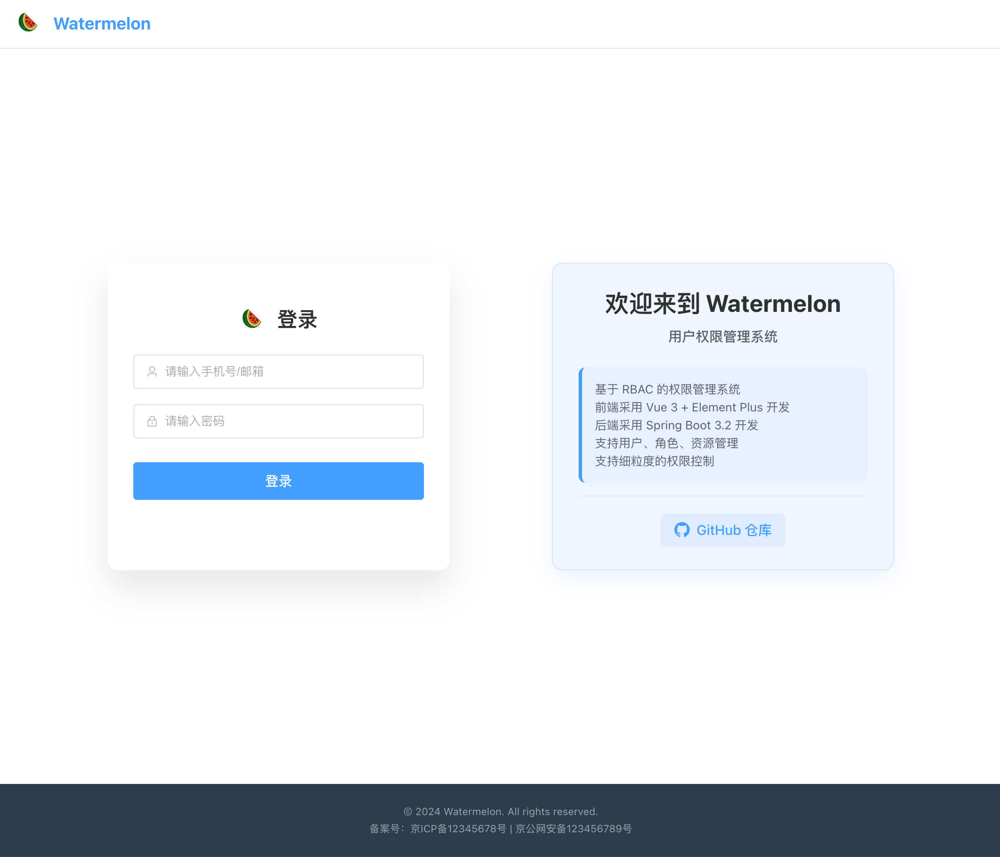
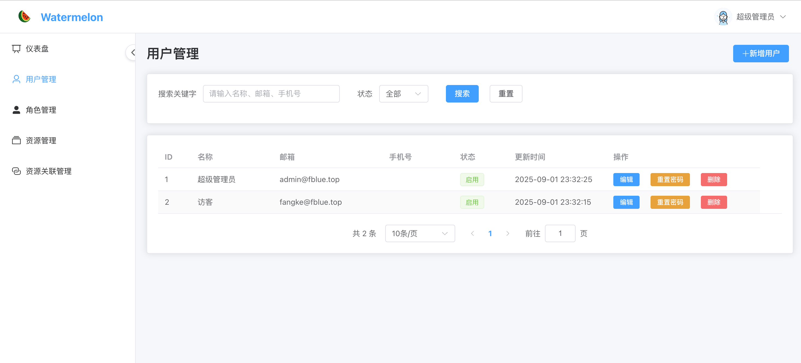
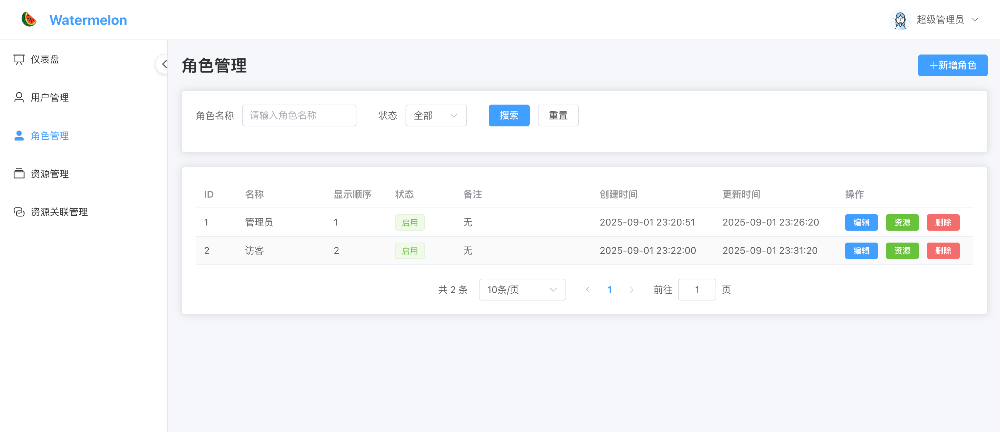
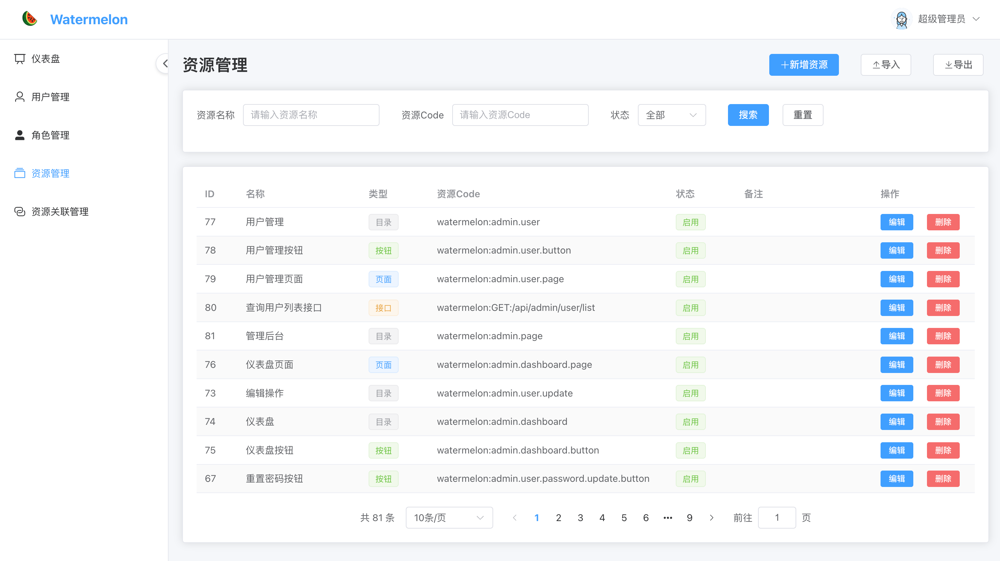
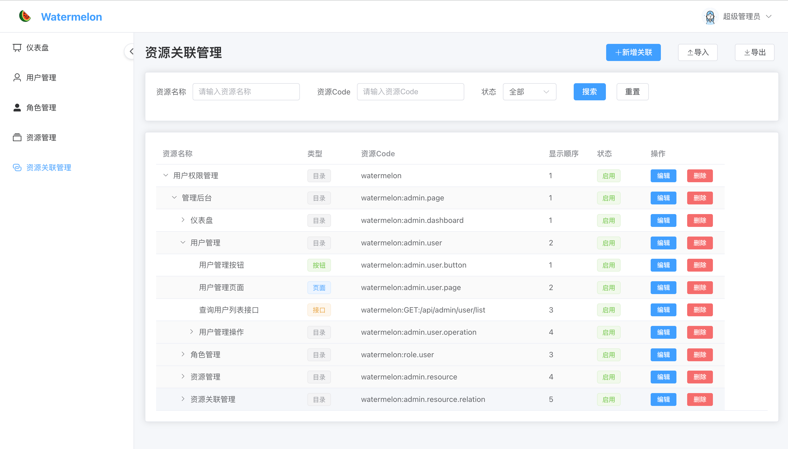

# Watermelon 用户权限管理系统

<p align="center">
  <a href="https://github.com/Yi-Xing/watermelon" target="_blank">
   
  </a>
</p>

## 项目简介

基于 Vue 3 + TypeScript + Element Plus 的用户权限管理系统，实现了完整的 RBAC（基于角色的访问控制）权限模型。系统提供用户管理、角色管理、资源管理等核心功能，支持细粒度的权限控制。

- 前端：https://github.com/Yi-Xing/watermelon-vue
- 后端：https://github.com/Yi-Xing/watermelon

## 📸 系统截图

### 登录页面



### 用户管理



### 角色管理



### 资源管理



### 资源关联管理



## ✨ 功能特性

### 🔐 权限管理

- **用户管理**：创建、编辑、删除用户，修改用户密码
- **角色管理**：定义用户角色，配置角色权限
- **资源管理**：管理系统资源，支持 Excel 导入导出
- **资源关联管理**：配置资源之间的关联关系

### 🛡️ 安全特性

- JWT Token 认证，自动刷新机制
- 路由级权限控制
- 按钮级权限控制（通过自定义指令）
- 403/404 错误页面

### 🎨 用户体验

- 响应式设计
- Element Plus 组件库，界面美观
- 路由懒加载

## 🛠️ 技术栈

### 前端框架

- **Vue 3** - 渐进式 JavaScript 框架
- **TypeScript** - 类型安全的 JavaScript 超集
- **Vite** - 快速的前端构建工具

### UI 组件库

- **Element Plus** - Vue 3 组件库
- **@element-plus/icons-vue** - Element Plus 图标

### 状态管理

- **Pinia** - Vue 3 官方推荐的状态管理库

### 路由管理

- **Vue Router 4** - Vue 3 官方路由管理器

### 开发工具

- **ESLint** - 代码质量检查
- **Prettier** - 代码格式化
- **Vue DevTools** - Vue 开发者工具

## 📁 项目结构

```
src/
├── api/                    # API 接口
│   ├── admin/             # 管理员相关接口
│   │   ├── resource.ts    # 资源管理
│   │   ├── resourceRelation.ts # 资源关联
│   │   ├── role.ts        # 角色管理
│   │   └── user.ts        # 用户管理
│   └── auth.ts            # 认证接口
├── components/            # 公共组件
│   ├── admin/            # 管理后台组件
│   ├── common/           # 通用组件
│   └── icons/            # 图标组件
├── composables/          # 组合式函数
│   ├── useApi.ts         # API 调用封装
│   ├── useHttp.ts        # HTTP 请求封装
│   └── usePassword.ts    # 密码处理
├── constants/            # 常量定义
│   ├── localStorageKey.ts # 本地存储键名
│   └── permissionCode.ts  # 权限代码定义
├── directives/           # 自定义指令
│   ├── index.ts          # 指令注册
│   └── permission.ts     # 权限控制指令
├── layouts/              # 布局组件
│   └── AdminLayout.vue   # 管理后台布局
├── router/               # 路由配置
│   └── index.ts          # 路由定义和权限守卫
├── services/             # 业务服务
│   └── auth.ts           # 认证服务
├── stores/               # 状态管理
│   ├── userInfo.ts       # 用户信息状态
│   └── userToken.ts      # 用户Token状态
├── types/                # TypeScript 类型定义
├── views/                # 页面组件
│   ├── admin/            # 管理后台页面
│   ├── 403.vue           # 权限不足页面
│   ├── 404.vue           # 页面不存在
│   └── LoginView.vue     # 登录页面
└── main.ts               # 应用入口
```

## 🚀 快速开始

### 环境要求

- Node.js >= 20.19.0 或 >= 22.12.0
- pnpm（推荐）或 npm

### 安装依赖

```bash
pnpm install
```

### 开发环境运行

```bash
pnpm dev
```

应用将在 `http://localhost:3000` 启动

### 构建生产版本

```bash
pnpm build
```

## ⚙️ 配置说明

### 开发服务器配置

开发服务器默认运行在端口 3000，并配置了 API 代理：

```typescript
// vite.config.ts
server: {
  port: 3000,
  host: '0.0.0.0',
  proxy: {
    '/api': {
      target: 'http://127.0.0.1:8080',
      changeOrigin: true,
      secure: false,
    },
  },
}
```

### 环境变量

在项目根目录创建 `.env.local` 文件配置环境变量：

```env
# API 基础地址
VITE_API_BASE_URL=http://127.0.0.1:8080

# 其他配置...
```

## 🔐 权限系统说明

### 权限模型

本系统采用 RBAC（基于角色的访问控制）模型：

1. **用户（User）**：系统的操作主体
2. **角色（Role）**：权限的集合
3. **资源（Resource）**：可访问的系统资源（页面、按钮等）
4. **权限（Permission）**：对资源的操作权限

### 权限类型

- **页面权限**：控制用户可以访问哪些页面
- **按钮权限**：控制用户可以看到和操作哪些按钮

### 权限使用

#### 1. 路由权限

在路由配置中通过 `meta.permission` 字段配置页面权限：

```typescript
{
  path: 'users',
  name: 'admin-users',
  component: UserManagement,
  meta: { permission: PAGE_PERMISSIONS.ADMIN_USER_PAGE },
}
```

#### 2. 按钮权限

使用 `v-permission` 指令控制按钮显示：

```vue
<el-button v-permission="BUTTON_PERMISSIONS.ADMIN_USER_ADD_BUTTON">
  添加用户
</el-button>
```

## 🤝 开发规范

### 代码风格

- 使用 TypeScript 进行类型检查
- 遵循 ESLint 配置的代码规范
- 使用 Prettier 进行代码格式化

### 组件开发

- 使用 Vue 3 Composition API
- 优先使用 `<script setup>` 语法
- 合理使用 TypeScript 类型定义

### 状态管理

- 使用 Pinia 进行状态管理
- 按功能模块划分 Store
- 避免在组件中直接操作状态

## 📄 许可证

本项目采用 MIT 许可证，详情请查看 [LICENSE](LICENSE) 文件。

## 📞 联系方式

如有问题或建议，请通过以下方式联系：

- 问题反馈: https://github.com/Yi-Xing/watermelon-vue/issues
